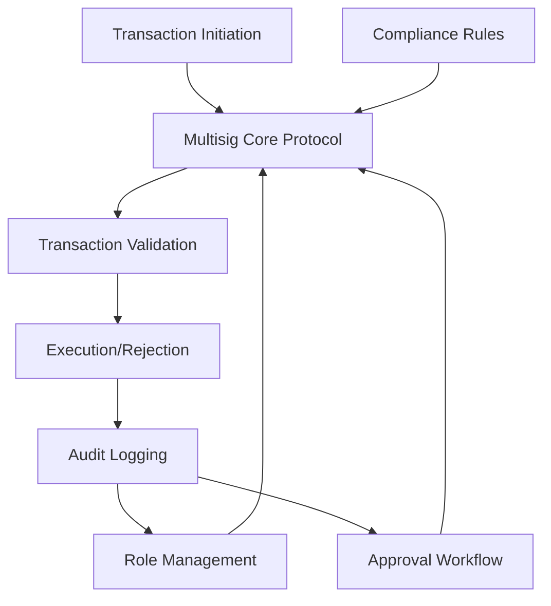

# Multisig Compliance Protocol

A decentralized protocol for managing multi-signature transactions and compliance workflows across blockchain-based systems.

## Overview

Multisig Compliance creates a secure, transparent framework for:
- Multi-signature transaction management
- Compliance verification and tracking
- Role-based access control
- Auditable transaction histories
- Decentralized governance mechanisms

The protocol provides a robust infrastructure for organizations to implement complex approval processes with cryptographic security.

## Architecture

The protocol consists of several interconnected components:



### Core Components
- **Transaction Management**: Handles multi-signature transaction lifecycles
- **Role & Permissions**: Defines hierarchical access control
- **Compliance Rules**: Enforces organizational and regulatory requirements
- **Approval Workflow**: Manages sequential and threshold-based approvals
- **Audit Trail**: Provides transparent, immutable transaction histories

## Contract Documentation

### Multisig Compliance Core (`multisig-compliance-core.clar`)

The main contract handling protocol functionality:

#### Key Features
- Multi-signature transaction creation
- Role-based access management
- Compliance rule enforcement
- Approval workflow tracking
- Comprehensive audit logging

#### Access Control
- Configurable role hierarchies
- Threshold-based approval mechanisms
- Immutable transaction tracking
- Secure, decentralized governance

## Getting Started

### Prerequisites
- Clarinet
- Stacks wallet for testing

### Installation
1. Clone the repository
2. Install dependencies with Clarinet
3. Deploy contracts to local Clarinet chain

### Basic Usage Example
```clarity
;; Register a user profile
(contract-call? .glow-link-core register-user 
    "oily" 
    (list "acne" "texture") 
    (list "clarifying" "hydration"))

;; Generate a recommendation
(contract-call? .glow-link-core generate-recommendation 
    25 ;; temperature
    60 ;; humidity
    5  ;; UV index)
```

## Function Reference

### User Management
```clarity
(register-user (skin-type (string-ascii 20)) 
               (concerns (list 5 (string-ascii 20))) 
               (goals (list 5 (string-ascii 20))))

(update-user-profile (skin-type (string-ascii 20)) 
                     (concerns (list 5 (string-ascii 20))) 
                     (goals (list 5 (string-ascii 20))))
```

### Expert Functions
```clarity
(verify-expert (expert principal) 
               (credentials (string-utf8 500)))

(submit-routine-template (name (string-utf8 100)) 
                        (description (string-utf8 500)) 
                        ...)
```

### Recommendation System
```clarity
(generate-recommendation (temperature int) 
                        (humidity uint) 
                        (uv-index uint))

(submit-feedback (recommendation-id uint) 
                 (rating uint) 
                 (comments (optional (string-utf8 300))))
```

## Development

### Testing
Run the test suite:
```bash
clarinet test
```

### Local Development
1. Start Clarinet console:
```bash
clarinet console
```

2. Deploy contracts:
```bash
clarinet deploy
```

## Security Considerations

### Limitations
- Weather data should come from a trusted oracle in production
- Recommendation matching algorithm is simplified for demonstration
- Expert verification requires trusted administrator

### Best Practices
- Validate all user inputs
- Use proper error handling
- Implement rate limiting for recommendation generation
- Ensure feedback can only be submitted once per recommendation
- Maintain separate concerns between user profiles and expert verification